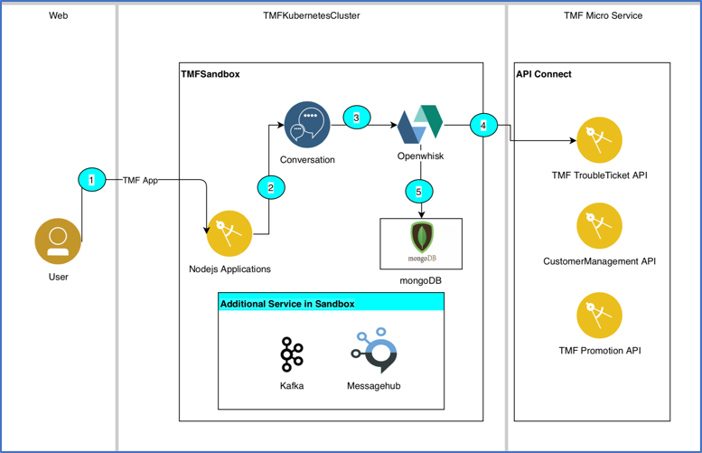

# Watson Chat Bot for TMF using OpenWhisk

 

This project was created a sample project to showcase during TMForums. uses NodeJS and Watson Assistant in order create a Chat Bot. It is run with IBM Functions(OpenWhisk) in order to pull TMForums Trouble Ticketing API's. 
The Application uses the chat bot to run the APIs via IBM functions in order to pull the ticket status. 

[OpenWhisk](https://console.bluemix.net/openwhisk/).

To see a list of IBM Services, visit here: https://console.bluemix.net/catalog/

<p align="center">
  

## The Architecture

## Getting Started

